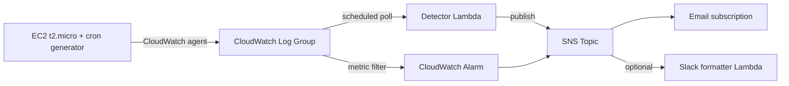

# Cloud Log Monitoring & Analysis System

Rule-based anomaly detection for a small EC2 fleet, brute-force logins, suspicious IPs, and traffic spikes, alerting through SNS, deployed with Terraform and GitHub Actions.

## Badges


[](https://github.com/OWNER/cloud-log-monitoring-system/actions/workflows/ci.yml)

Replace `OWNER` in the CI badge URL above with your GitHub username once you push this, the badge will start reflecting real workflow runs at that point, it's not populated until then.

## Table of Contents

- [Overview](#overview)
- [Demo](#demo)
- [Architecture](#architecture)
- [Tech Stack](#tech-stack)
- [Features](#features)
- [Setup & Installation](#setup--installation)
- [Usage](#usage)
- [Testing](#testing)
- [Benchmark / Results](#benchmark--results)
- [Known Limitations](#known-limitations)
- [AI Notes](#ai-notes)
- [License](#license)

## Overview

This project ingests logs from an EC2 instance, runs them through three rule-based detectors (brute-force login bursts, non-allowlisted IPs making repeated requests, and traffic volume spikes), and alerts over SNS when something fires. All of it is defined as Terraform, deployable and destroyable with one command, and pushed through a GitHub Actions pipeline that gates production changes behind manual approval.

The detection logic lives in a standalone, dependency-free Python module (`detector/rules.py`) that's fully unit tested against synthetic fixtures, independent of whether anything is actually deployed to AWS.

## Demo

The instance runs a cron job generating synthetic auth and access log traffic, since there's no real production workload to point this at, see [`log-generator/`](log-generator/) for details. Run `python scripts/smoke_test.py` after bootstrap to see it end-to-end locally: synthetic events generated, parsed, and all three rule types firing, no AWS account needed.

*(Add a screenshot or screen recording of the deployed CloudWatch dashboard here once you've run through `docs/DEPLOYMENT.md`.)*

## Architecture



Full write-up, including why polling was chosen over a CloudWatch Logs subscription filter, is in [`docs/architecture.md`](docs/architecture.md).

## Tech Stack

| Layer | Technology | Why chosen |
|---|---|---|
| Detection logic | Python 3.12, stdlib only | Zero runtime deps keeps the Lambda cold start fast and the unit tests trivial to run anywhere |
| Log ingestion | EC2 t2.micro + CloudWatch agent | Free-tier eligible, standard pattern for shipping instance logs |
| Anomaly detection | AWS Lambda (scheduled) | Stateless polling avoids needing external state for rolling-window rules, see architecture.md |
| Alerting | SNS + email, optional Lambda-to-Slack | SNS fan-out is the standard AWS-native alerting primitive |
| IaC | Terraform | Single tool covers both AWS and GCP, one destroy command for the whole stack |
| CI/CD | GitHub Actions + OIDC | No static AWS keys stored anywhere, short-lived federated credentials only |
| Second cloud | GCP Cloud Functions + Cloud Logging | Small, real, independently deployable piece, see architecture.md for scope reasoning |
| Security scanning | tfsec | Runs in CI on every PR, blocks on findings |

## Features

- Three independent, unit-tested detection rules: brute-force bursts, suspicious IP persistence, traffic spikes.
- Synthetic log generator producing realistic SSH and HTTP traffic patterns, standalone and runnable with zero AWS access.
- Full IAM least-privilege setup, one role per function, every permission documented with its reason in `docs/iam_policy_rationale.md`.
- GitHub Actions OIDC federation, no static AWS credentials anywhere, including in CI.
- Manual-approval gate on `terraform apply` via GitHub Environments, nothing deploys to production without a human clicking approve.
- CloudWatch dashboard (deployed as code) showing failed-login volume, alerts fired, and log volume by source.
- Everything fits AWS/GCP free tier, documented cost breakdown included.
- One-command local bootstrap for everything that doesn't need cloud credentials.

## Setup & Installation

Clone the repo, then run the bootstrap script, this handles the venv, dependencies, lint, unit tests, and the smoke test:

```bash
git clone https://github.com/OWNER/cloud-log-monitoring-system.git
cd cloud-log-monitoring-system
./bootstrap.sh
```

That verifies the detection logic, log generator, and Slack formatter all work, entirely locally, no AWS or GCP account needed.

To actually deploy the infrastructure, see [`docs/DEPLOYMENT.md`](docs/DEPLOYMENT.md), that's a separate, explicit step since it needs your own cloud credentials and will create billable (though free-tier) resources.

## Usage

Generate a sample log file locally:

```bash
source .venv/bin/activate
python log-generator/generate.py --minutes 10 --seed 42 --out sample.log
```

Run the detection rules against it directly:

```bash
python scripts/smoke_test.py
```

Once deployed (see `docs/DEPLOYMENT.md`), tail real CloudWatch Logs or manually invoke the detector:

```bash
aws logs tail /cloud-log-monitor/demo-instance --follow
aws lambda invoke --function-name cloud-log-monitor-detector /tmp/out.json && cat /tmp/out.json
```

## Testing

```bash
python -m pytest detector/tests alerting/tests -v
```

17 tests covering: each detection rule's fire/no-fire boundary conditions, IP independence in the brute-force rule, the log line parser against real sshd/access-log line shapes, and the Slack payload formatter (formatting logic only, no network calls in tests).

`tfsec` runs in CI against `infra/` on every PR as the infrastructure-side test, a clean scan is required to merge.

## Benchmark / Results

| Metric | Result |
|---|---|
| Unit tests | 17/17 passing |
| Smoke test (synthetic data, seed 7) | 178 lines generated, 178 parsed, 3/3 expected rule types fired |
| Detection rule coverage | brute-force, suspicious IP, traffic spike, each with fire and no-fire cases tested |
| tfsec findings (target) | 0 high/critical |

## Known Limitations

See [`docs/known_limitations.md`](docs/known_limitations.md) for the full, honest list, highlights: synthetic traffic only (no real workload validated against), static rather than adaptive traffic-spike baseline, no alert deduplication across polling windows, and a broader-than-ideal IAM role for the GitHub Actions deploy step (scoped by OIDC repo/branch trust and a manual approval gate instead, see `docs/iam_policy_rationale.md` for the specific tradeoff).

## AI Notes

See [AI_NOTES.md](AI_NOTES.md) for a full breakdown of how AI tools were used during development.

## License

MIT, see [LICENSE](LICENSE).
