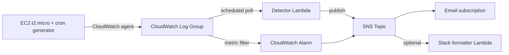

# Architecture

## Data flow

1. A t2.micro EC2 instance runs a cron job every 2 minutes that appends
   synthetic auth and access log lines to `/var/log/demo/{auth,access}.log`.
2. The CloudWatch agent tails both files and ships lines into a single
   CloudWatch Log Group.
3. A scheduled Lambda (`detector/handler.py`) polls the last N minutes of
   that log group every `poll_window_minutes`, parses lines into `LogEvent`
   objects, and runs them through the three detection rules in
   `detector/rules.py`.
4. Any rule that fires publishes an `Alert` to an SNS topic.
5. SNS fans out to an email subscription and, optionally, a second Lambda
   that reformats the message for a Slack webhook.
6. A CloudWatch metric filter on `"Failed password"` lines also drives a
   native CloudWatch Alarm as a simpler backstop, independent of the
   Lambda's more precise rolling-window logic.

## Why scheduled polling instead of a subscription filter

CloudWatch Logs subscription filters push matching log events to a Lambda
in near real time, which sounds like the obvious choice for anomaly
detection. Two things pushed this toward scheduled polling instead:

- The brute-force and traffic-spike rules need a rolling window of events
  to evaluate, not a single line. A subscription filter invokes the
  Lambda per batch of matching events as they arrive, which means the
  Lambda would need to maintain state (a DynamoDB table or similar)
  across invocations to reconstruct the window. A scheduled poll just
  pulls the whole window fresh each run, no external state needed.
- A subscription filter's pattern syntax would have to pre-filter which
  lines even reach the Lambda, which pushes some detection logic into
  the filter pattern itself and splits it from `detector/rules.py`. That
  breaks the "detection logic lives in one unit-testable module" goal.

The tradeoff is latency: alerts lag by up to `poll_window_minutes`
instead of firing within seconds. For a demo system with a 5 minute
window, that's an acceptable trade for simpler, fully stateless code.

## Why GCP is a separate, smaller piece

The GCP side (`infra/gcp/`) is a Cloud Function that accepts the same
synthetic event JSON shape and writes it to Cloud Logging as structured
entries. It intentionally does not share detection logic with the AWS
side or forward alerts cross-cloud. Building a real cross-cloud detection
pipeline would roughly double the scope of this project for a demo whose
actual goal is proving hands-on GCP familiarity, not multi-cloud
correlation. See `known_limitations.md` for what a real version of that
would need.
